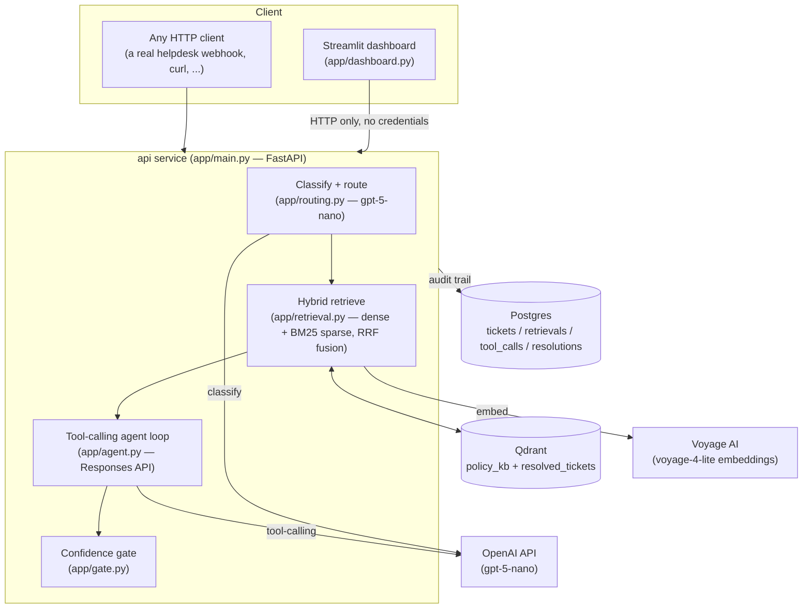

# GateDesk

A support-ticket automation system for **Flowbase** (a fictional project-management SaaS): it classifies incoming tickets, retrieves relevant policy and precedent, lets an LLM agent take action through a fixed set of tools, and — before any of that action counts as a real auto-resolution — independently checks it with a **confidence gate**. Anything the gate doesn't trust gets escalated to a human, with the agent's original decision preserved as a draft for review.

Built as a portfolio project to demonstrate real RAG + agentic-system architecture decisions, not just an LLM API call. See [`DECISIONS.md`](DECISIONS.md) for the reasoning behind each one, and [`ARCHITECTURE.md`](ARCHITECTURE.md) for the original phase-by-phase build plan.

## Why a gate, not just an agent

The core bet of this project: an LLM tool-calling loop is a *proposal*, not a decision. `gpt-5-nano` (the cheapest OpenAI model, used throughout to keep this a $0 learning project) is reliable at simple classification but occasionally loses track of its own tools mid-loop in the harder agentic task — during development it twice skipped calling `lookup_account` and instead wrote escalation instructions addressed to a hypothetical human, as if it had forgotten it could act itself.

The fix wasn't a bigger model — it was making sure the failure direction is always safe. The gate independently checks the agent's chosen action against retrieval grounding, the agent's own self-reported confidence, and a couple of hard-coded policy rules (P0/P1 bugs always escalate, no confidence score can override that) before it's allowed to stand as an auto-resolution. Every time the underlying model got confused, the system's *output* was still correct: escalate to a human, never a wrong auto-resolved action taken with confidence.

## Results

Full pipeline run over 16 held-out tickets (`data/eval_set.json`), via `python scripts/evaluate.py`:

| Metric | Value |
|---|---|
| Category classification accuracy | 100% |
| Outcome accuracy (auto-resolve vs escalate) | 100% |
| **False-resolve rate** (wrongly auto-resolved when it should've escalated) | **0%** |
| Policy grounding hit rate | 100% |
| Total cost for the eval run | **$0.0098** ($0.0006/ticket) |

Full report with per-ticket breakdown: [`EVAL_RESULTS.md`](EVAL_RESULTS.md) (regenerate with `python scripts/evaluate.py`).

## Architecture



The dashboard holds no OpenAI/Voyage/Qdrant/Postgres credentials — it's a pure HTTP client of the `api` service, same as any other caller would be. That split (not just "because the plan said FastAPI") is what makes `api` and `dashboard` meaningfully separate Docker services rather than the same code running twice.

## Quickstart

Requires Docker and an OpenAI + Voyage AI API key (Voyage's free tier is 200M tokens — this project won't come close).

```bash
cp .env.example .env        # fill in OPENAI_API_KEY and VOYAGE_API_KEY
docker compose up -d --build
```

First boot auto-indexes Qdrant (policy docs + seed tickets) if the collections are empty — nothing else to run manually.

- Dashboard: [http://localhost:8501](http://localhost:8501)
- API: [http://localhost:8000/health](http://localhost:8000/health), [http://localhost:8000/docs](http://localhost:8000/docs) for interactive API docs
- Submit a ticket via the dashboard's "Submit New Ticket" tab, using a `customer_email` from `data/accounts_seed.json` (e.g. `alice@acme.io`) so account lookups resolve to something real.

```bash
docker compose down -v   # tear down + wipe volumes, to test the fresh-boot path again
```

### Local (non-Docker) development

```bash
uv venv && source .venv/bin/activate && uv pip install -r requirements.txt
docker compose up -d qdrant postgres      # just the infra, not api/dashboard
python scripts/index.py                    # manual index (optional — api does this automatically)
uvicorn app.main:app --reload --port 8000
API_BASE_URL=http://localhost:8000 streamlit run app/dashboard.py
```

Useful scripts:
- `python scripts/trace.py [ticket_id]` — list tickets, or pretty-print the full audit trail (retrieval, tool calls, gate decision, resolution) for one
- `python scripts/evaluate.py [ticket_ids...]` — run the eval harness, full set or a subset

## Project structure

```
app/
  config.py       shared settings, category -> doc_type / tool-surface routing tables
  embeddings.py   dense (Voyage) + sparse (local BM25 via fastembed) embedding helpers
  indexing.py     chunk policy docs + seed tickets, embed, upsert into Qdrant
  retrieval.py    hybrid search (RRF fusion) + dense-cosine confidence scoring
  routing.py      ticket classification (category + urgency) via gpt-5-nano
  tools.py        mock tool implementations + OpenAI function schemas
  agent.py        the tool-calling loop (OpenAI Responses API)
  gate.py         the confidence gate — deterministic rules + tiered thresholds
  db.py           Postgres schema + query helpers (shared by trace.py, dashboard.py, main.py)
  usage.py        OpenAI token/cost tracking
  main.py         FastAPI service (the real ingestion boundary)
  dashboard.py    Streamlit demo UI (HTTP client of main.py, no direct DB/API-key access)
data/
  policy_docs/    Flowbase's support policy docs (source of truth for the RAG index)
  tickets_seed.json   32 past resolved tickets (precedent index)
  eval_set.json       16 held-out tickets with known-correct outcomes
  accounts_seed.json  mock customer accounts for the tool layer
scripts/
  index.py        CLI wrapper around app/indexing.py
  evaluate.py     the eval harness (Phase 8)
  trace.py        CLI audit-trail viewer (Phase 7)
```

## Tech stack

| Layer | Choice | Why |
|---|---|---|
| LLM | OpenAI `gpt-5-nano` | Cheapest current model; see [`DECISIONS.md`](DECISIONS.md) for the reliability tradeoff this implies |
| Embeddings | Voyage AI `voyage-4-lite` | 200M free tokens/month, effectively $0 at this project's scale |
| Sparse retrieval | Local BM25 (fastembed) | Zero-cost, zero-API-call keyword signal alongside dense vectors |
| Vector store | Qdrant | Native hybrid (dense + sparse) search with RRF fusion, self-hosted |
| Audit DB | Postgres | Real relational audit trail, not an in-memory dict |
| Backend | FastAPI | The actual ingestion boundary — see architecture diagram |
| Demo UI | Streamlit | Fast to build, screen-recording friendly |
| Orchestration | Raw OpenAI Responses API, no LangChain/LlamaIndex | Every step is explainable without "the framework does it" |
| Packaging | Docker Compose, single command | `docker compose up` and nothing else, on any machine |
